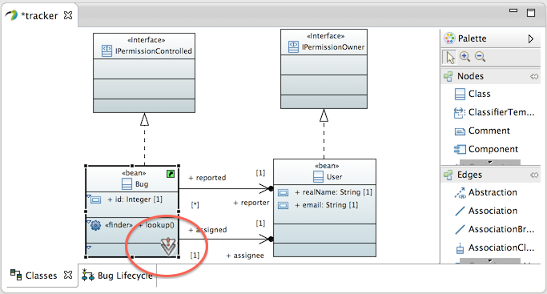

# Sharing Models with a Team
One purpose of keeping Papyrus models in a CDO model repository is to share them with a team and enjoy the benefits of real-time collaboration that CDO offers.  However, this entails certain consequences that need to be accounted for in the workflow.

## <a id="Locking">Locking Objects</a>
The context menu in both the **Model Explorer** view and the diagrams has actions for locking and unlocking objects.  Locking a model element reserves it for the exclusive use of the editor that has it locked.  Other users connected to the same repository cannot edit it.  Locking an element in a diagram locks not only the model element, but also the view of it in the diagram.

An object locked by you shows a key decoration.  To lock an element, use the **Locks/Conflicts &rarr; Lock** context menu action:

To unlock an object once you have finished editing it and saved the model, use the **Locks/Conflicts &rarr; Unlock** context menu action.  Locks are also automatically released when the editor that holds them is closed.

When another user has locked an element, the editor shows a lock decoration:

Note that in this case, the element cannot be edited:  the **Properties** view is disabled and the diagram editor does not show the selection handles.

## <a id="Conflicts">Handling Conflicts</a>
CDO is a real-time collaborative editing platform.  When other users save changes they have made in models that are open in your Papyrus workbench, the repository server pushes those changes into your editors.  You see those changes in real time.  There is no "synchronize" step as with Git or Subversion source control.

Most changes saved by other users will be in different model elements and diagram views than those in which you have unsaved changes.  These do not present a problem.  However, the repository may push changes in objects that you *have* edited and have not yet saved.  Many of these changes, too, are automatically merged by Papyrus:  changes to features of an object that you have not modified and certain changes in multi-valued features can be merged automatically.  Other changes leave the objects that you have edited in a state of conflict.  This is indicated by a decoration in the diagrams and the **Model Explorer** view:

Papyrus cannot automatically resolve these conflicts by merging the incoming changes from the repository with the changes made in your editor.  They require manual intervention to resolve.

On an object that shows conflict, invoke the **Locks/Conflicts &rarr; Resolve Conflicts** context menu action.  In the current release, the only strategy available is to rollback the editor's unsaved changes, leaving only the changes pushed by the server from other users.  Future releases will add more options, such as an interactive graphical merge.